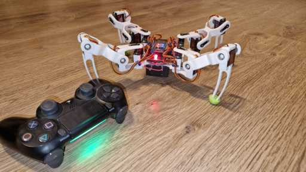

# Quadruped sterowany padem PS4
Czteronożny robot kroczący zaprojektowany i wydrukowany w technologii 3D, sterowany kontrolerem PS4, zbudowany przy użyciu serwomechanizmów oraz mikrokontrolera ESP32. Robot porusza się do przodu, do tyłu, w boki, skręca, zmienia wysokość, wykonuje rotacje w osiach roll, pitch, yaw.

## technologie
- ESP32 (mikrokontroler)
- Serwomechanizmy
- C/C++ (kinematyka odwrotna + sterowanie)
- Bluetooth (połączenie z padem ps4)
- CAD/druk 3D (części własnej konstrukcji)

## Funkcje
- Poruszanie się do przodu i tyłu
- Skręcanie w lewo i w prawo
- Rotacje wokół osi roll, pitch, yaw
- Samodzielnie zaprojektowane części drukowane w 3D

## Instrukcja uruchomienia
Załącz zasilanie robota -> robot wstanie
Naduś i trzymaj przyciski PS + SHARE na kontrolerze -> robot szuka kontrolera po adresie MAC
Po sparowaniu robot jest gotowy do sterowania!

## Media
- Filmik prezentujący robota w ruchu: https://www.youtube.com/watch?v=MLlye4q7GO4
- Zdjęcia robota w folderze: [Media](Media/)

### Completed Feautures
- IK (inverse kinematics),
- chodzenie przód / tył, prawo / lewo,
- skręcanie,
- rotacje roll, pitch, yaw.

## Autor
[Mikołaj Papierski]
kontakt: [miczkipap@gmail.com]
